Gus Class | Developer Programs Engineer | Google Cloud IoT Core

FogLamp from Dianomic provides a robust solution for getting data from sensors
into data stores.  The following diagram illustrates the platform architecture
for FogLamp in the context of Google Cloud IoT Core (Cloud Iot Core).

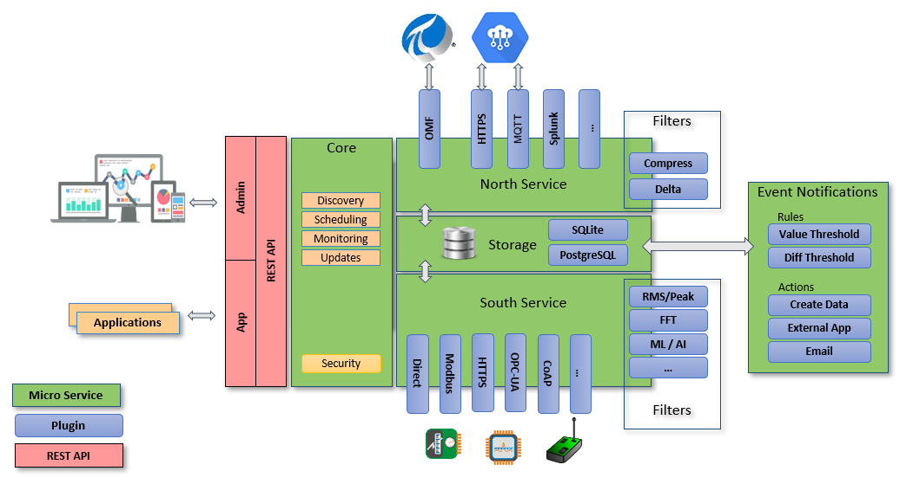

In the context of getting data into Google Cloud from sensors, the FogLamp
architecture consists of a service that bridges sensors that communicate
through FogLamp using the "South" service to Google Cloud Platform as a data
store on the "North" service.

For this quickstart we'll be using a Raspberry Pi to host the FogLamp service.

## Setup your Raspberry Pi with the Raspbian Buster image
This tutorial requires that you use the Debian Buster version of the Raspberry
Pi software because it uses packages built for that version of Linux. To get
Buster on your Raspberry Pi, first download a Raspbian buster image from the
[Raspbian downloads page](https://www.raspberrypi.org/downloads/raspbian/).

Next, unzip the image you downloaded, which will create a file that ends in
`.img`. For example, if you downloaded the "full" version of Raspbian, the
file would be named `2019-09-26-raspbian-buster-full.img`.

After you have unzipped the image file, create the SD card image for your
Raspberry Pi using a disk image utility. Raspberry Pi recommends that you use
[balenaEtcher](https://www.balena.io/etcher/).

For more information about flashing your Raspberry Pi, see the detailed instructions
on [the Raspberry Pi install documentation](https://www.raspberrypi.org/documentation/installation/installing-images/README.md).

At this point, you will need to set up access the Raspberry Pi. If you intend
to access the Raspberry Pi in headless mode, follow the instructions for
[setting up headless](https://www.raspberrypi.org/documentation/configuration/wireless/headless.md)
on the Raspberry Pi site. Otherwise, connect your Raspberry Pi to a keyboard,
mouse, and display for local access.

Finally, you will want to do any final configuration of the Raspberry Pi with
the [raspi-config](https://www.raspberrypi.org/documentation/configuration/raspi-config.md)
utility such as expanding the filesystem and setting the user password.

You will be performing subsequent steps on the Raspberry Pi itself either over
SSH if you're working headless or on the Raspberry Pi hardware if you're using
the Desktop UI.

## Download the FogLamp packages
From your Raspberry Pi, download the FogLamp packages to the file system. For
the purposes of this tutorial, we'll be placing them in a folder named
`foglamp` in your user's home directory.

```
mkdir $HOME/foglamp
cd $HOME/foglamp
wget https://foglamp.s3.amazonaws.com/1.7.0/buster/armv7l/foglamp-1.7.0_armv7l_buster.tgz
tar -xzvf  foglamp-1.7.0_armv7l_buster.tgz
```

The folder will now have the base packages for FogLamp. Let's also download the
packages for the Google Cloud IoT Core North plugin.

```
wget https://github.com/GoogleCloudPlatform/community/raw/foglamp/tutorials/cloud-iot-foglamp/foglamp-north-gcp-1.7.0-arm71.tgz
tar -xzvf foglamp-north-gcp-1.7.0-arm71.tgz
```

At this point, the `foglamp` folder in your user's home directly will contain
all the requirements for getting your Raspberry Pi up and running.

## Install FogLamp and FogLamp GUI on your Raspberry Pi

After setting up your Raspberry Pi with the Raspbian Buster image and getting
the FogLamp packages, it's time to install the FogLamp service and FogLamp GUI.

The FogLamp Graphical User Interface (GUI) makes it easier to configure and
control FogLamp from your Raspberry Pi.

Browse to the folder that you downloaded the FogLamp packages to and install
the FogLamp and FogLamp GUI packages.
```
pushd $HOME/foglamp/foglamp/1.7.0/buster/armv7l/
sudo apt -y install foglamp-1.7.0-armv7l.deb
sudo apt -y install foglamp-gui-1.7.0.deb
```

Now you can start the FogLamp service and check its status.

```
export FOGLAMP_ROOT=/usr/local/foglamp
$FOGLAMP_ROOT/bin/foglamp start
$FOGLAMP_ROOT/bin/foglamp status
```

You can also navigate to the FogLamp GUI by navigating with your web browser
to the web server that started running on the Raspberry Pi when you installed
the FogLamp GUI. To determine the IP address of your server, run the ifconfig
command.

```
ifconfig
```

It will output the IP address of the network interfaces. The following example
shows how the output might look.

```
wlan0: flags=4163<UP,BROADCAST,RUNNING,MULTICAST>  mtu 1500
        inet 192.168.1.217  netmask 255.255.255.0  broadcast 192.168.1.255
        inet6 fe80::9f73:3b56:93c2:4ed4  prefixlen 64  scopeid 0x20<link>
        ether dc:a6:32:03:b7:cb  txqueuelen 1000  (Ethernet)
        RX packets 426133  bytes 305815327 (291.6 MiB)
        RX errors 0  dropped 0  overruns 0  frame 0
        TX packets 274458  bytes 172317386 (164.3 MiB)
        TX errors 0  dropped 0 overruns 0  carrier 0  collisions 0
```

In the above example, the ip address is `192.168.1.217` so you would open the
URL http://192.168.1.217.

When you navigate to the web server, you will see a dashboard similar to the
following image.

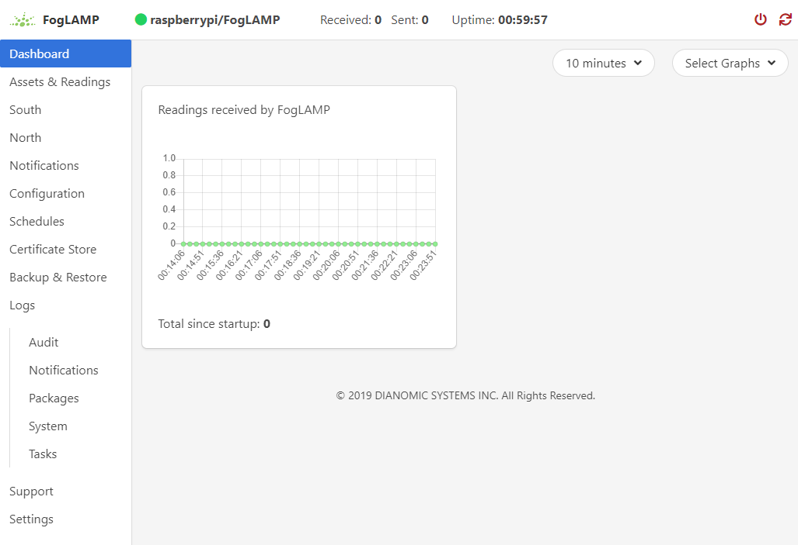

Now it's time to install the plug-ins for connecting to Google Cloud Platform
and generating data.

## Install a FogLamp South plugin for generating data
Before you set up a North Plugin for publishing data, you need data to publish.
One quick approach to getting data is to install the "random" plugin.

```
cd $HOME/foglamp/foglamp/1.7.0/buster/armv7
sudo apt install ./foglamp-south-random-1.7.0-armv7l.deb
```

Now navigate to the "South" menu on the left side of the FogLamp GUI navigation
and click the `Add +` button as seen in the following image.

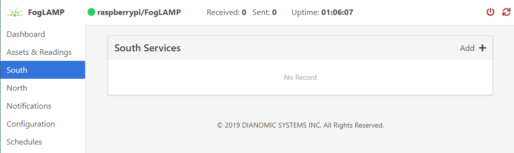

Now, select the Random plugin, give your plugin a name, e.g. `random`, and
click next.

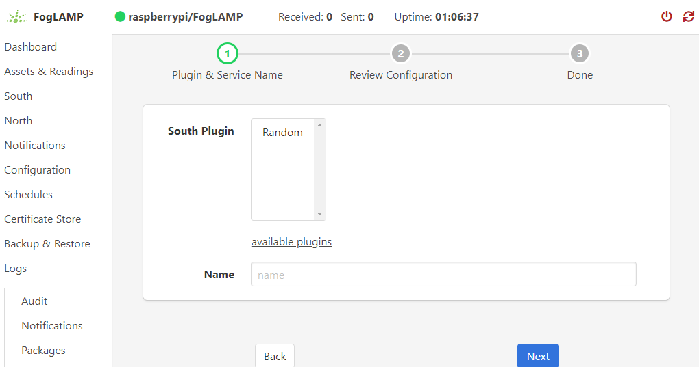

Click `Next` again on the next screen, then select `Done` on the final
form.

Navigating to the Dashboard or Assets & Readings menu on the FogLamp GUI will
show random data getting generated by the newly configured South plugin.

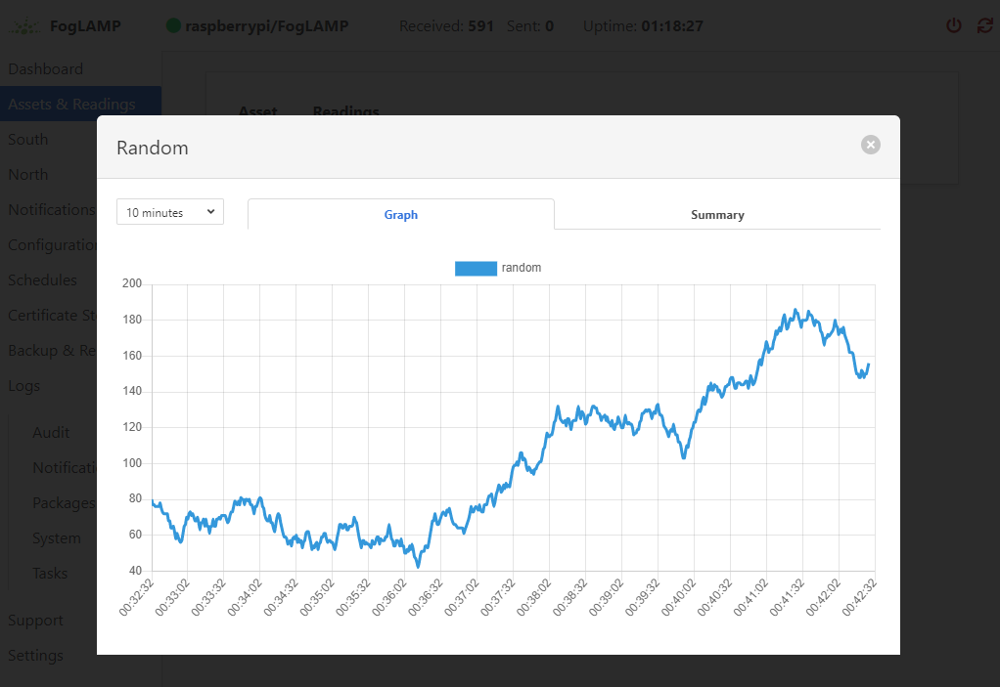

With data getting generated, it's time to start publishing that data to
Cloud IoT Core.

## Install and configure the FogLamp North Plugin for Cloud IoT Core
Now that you have data getting generated by the South Plugin, it's time to
publish that data to Google Cloud through the Iot Core device bridge. First,
install the FogLamp North Plugin for Google Cloud IoT Core (GCP-gateway).

```
cd $HOME/foglamp
sudo apt install ./foglamp-north-gcp-gateway-1.7.0-armv7l.deb
```

Now that you have installed the GCP-Gateway North plugin, navigate to the
North menu on the FogLamp GUI and click the `Create North Instance +` button.

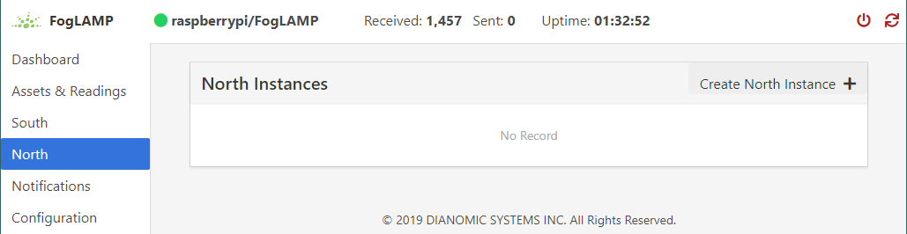

Select the `GCP-Gateway` plugin, give your instance a name, e.g. GCP, and click
the Next button.

Now you will need to create a device for communicating with Cloud IoT Core.
Start by navigating to the [Google Cloud IoT Core Console](https://console.cloud.google.com/iot)
and clicking `+ Create Registry`. Input a registry ID, e.g. foglamp, and input
a region, e.g. us-central1, and select an existing telemetry topic or create
a new topic such as projects/<your-project-id>/topics/foglamp before clicking
the Create button.

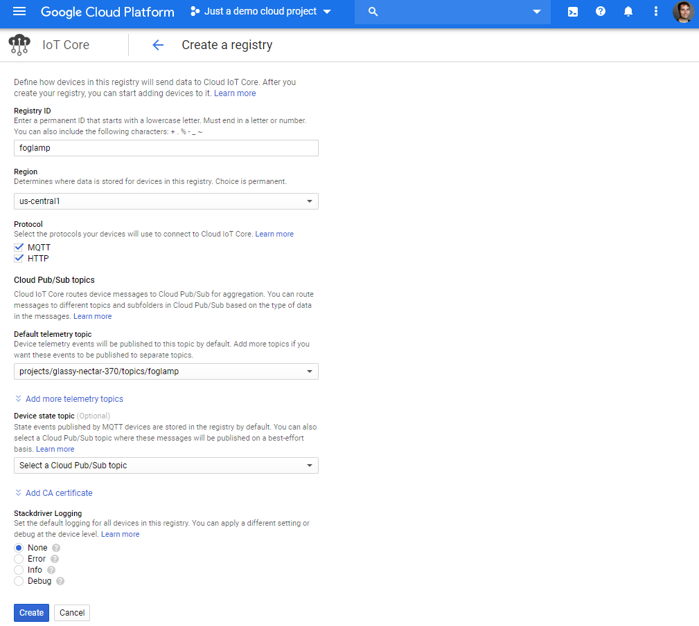

After creating the registry, you will be sent to the registry overview screen.
Next you will create a device that will be used to transmit data to Cloud IoT
Core. Before you can register a device you will need to create a keypair used
to authenticate the device. The following command will create an RSA
public/private keypair as described in the [IoT Core documentation](https://cloud.google.com/iot/docs/how-tos/devices).

```
cd $HOME/foglamp
openssl genpkey -algorithm RSA -out rsa_private.pem -pkeyopt rsa_keygen_bits:2048
openssl rsa -in rsa_private.pem -pubout -out rsa_public.pem
```

You will need the contents of the **public** key for creating your device. Use
the `cat` command to print the contents of the public key.

```
cat rsa_public.pem
```

With the contents of your public key available, it's time to register a device.
From the Devices menu on the Google Cloud IoT Core console, click the
`+ Create a device` button.

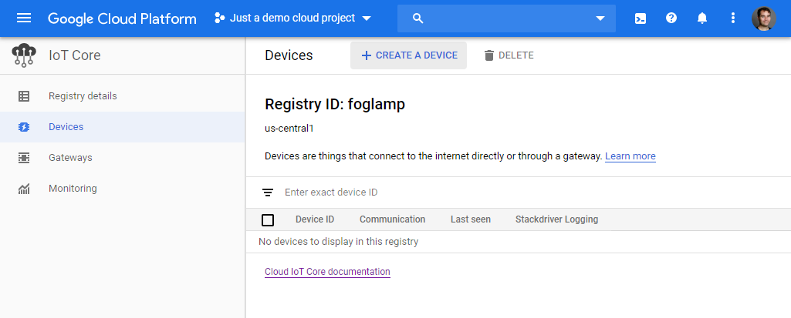

Input a device ID, e.g. foglamp, make sure the key format matches the type of
key you created in the last step, e.g. RS256, paste the contents of your public
key, and then click the Create button.

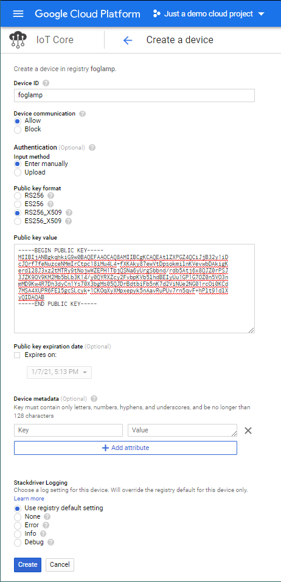

With your device added to the registry, it's time to configure the GCP-Gateway
North plugin to communicate using your device. First, you will need to copy the
device private key to the FogLamp certificate store as well as the root
certificate for Google Cloud IoT core.

```
wget https://pki.goog/roots.pem
cp roots.pem /usr/local/foglamp/data/etc/certs/
cp rsa_private.pem /usr/local/foglamp/data/etc/certs/
```

Now that the device has been created in the registry, you will need to
return to the FogLamp GUI screen to configure the North plugin. In the
Review Configuration screen, input your Project ID from the Google Cloud IoT
Core console (<your-project-id>, the registry name you used (foglamp), the
device ID (foglamp), the key name that was created (rsa_private), the JWT
algorithm (RS256), and the data source which is typically readings.

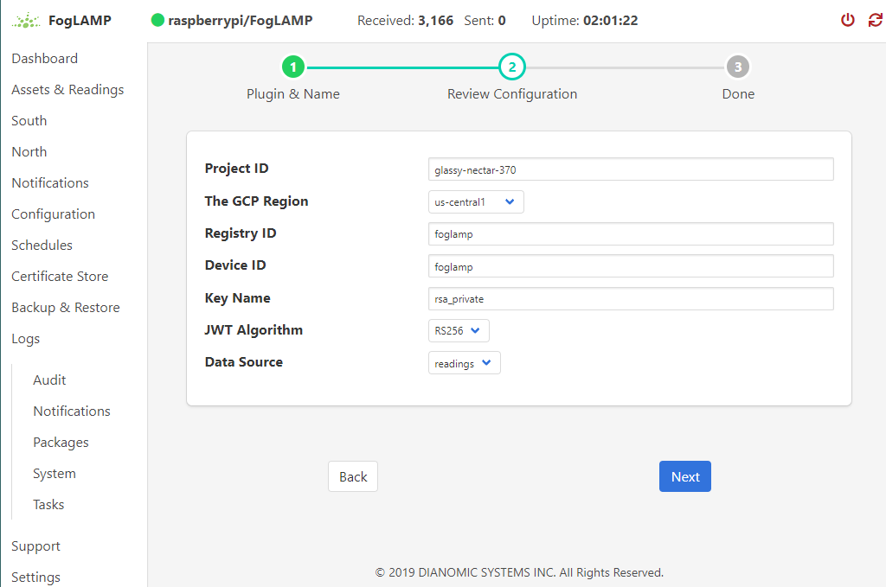

After you click Next, ensure the plugin is enabled on the following screen and
click Done.

Now, if you return to the dashboard, the count of readings Sent should be
incrementing while the Received readings increase. You can also navigate to the
Cloud IoT Core Console page for your device and see that telemetry events were
being received from the device.

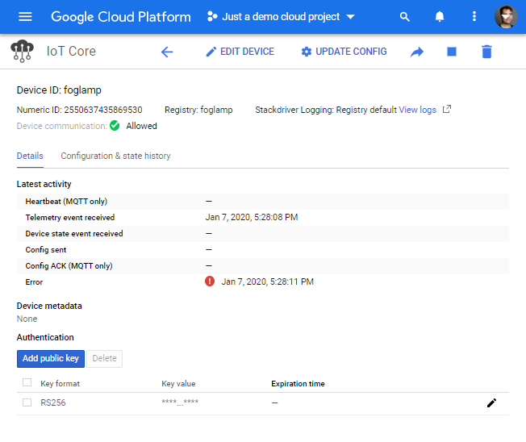

Congratulations, you've now setup FogLamp to publish data generated on the
Raspberry Pi! To see the telemetry messages, create a subscription to the
PubSub subscription configured in your registry by first clicking on the link
in the Registry Details page.

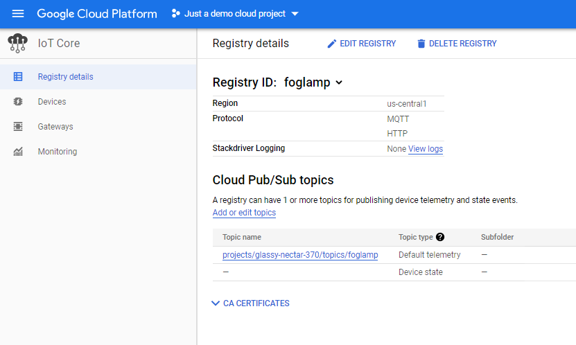

Clicking Create Subscription.

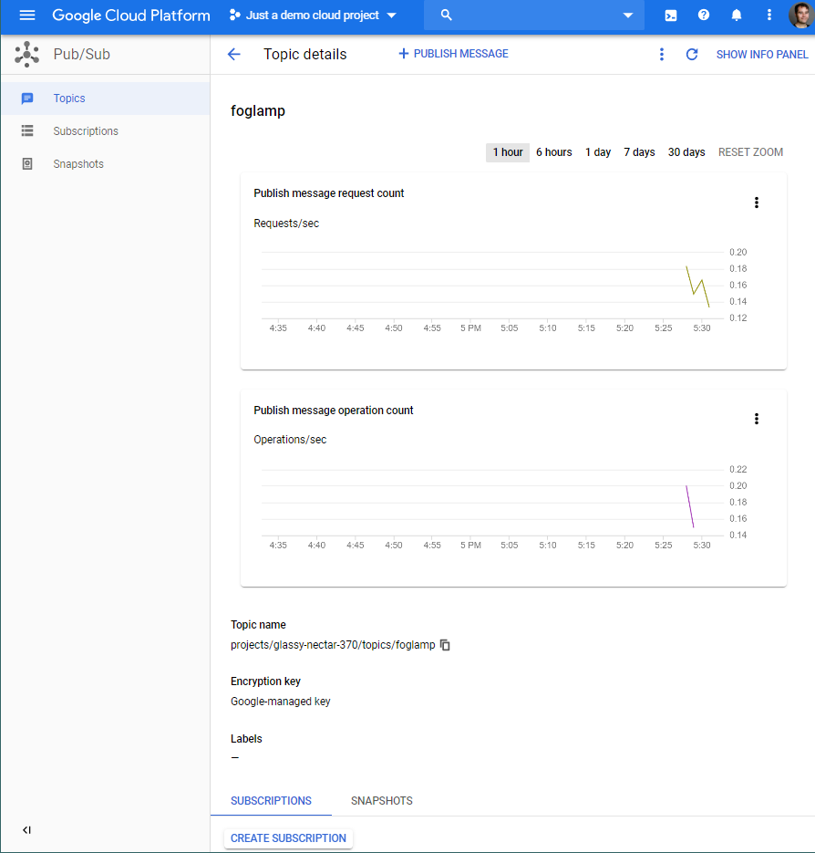

And finally, entering the subscription details such as the name for your
subscription (e.g. foglamp) before clicking the Create button.

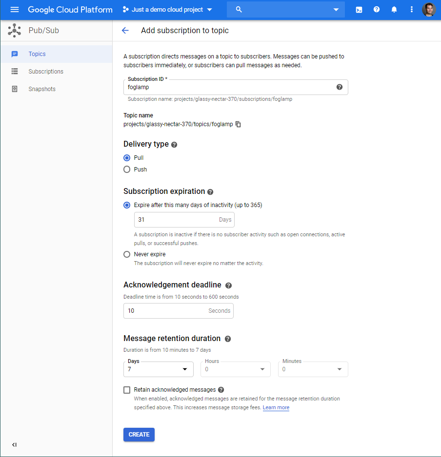

With the subscription created, you can see the messages published by FogLamp
using the [Google Cloud SDK](https://cloud.google.com/sdk). The following
command lists the messages published to the foglamp subscription.

```
gcloud pubsub subscriptions pull --limit 500 foglamp
```

The output will have JSON data corresponding to the generated data.

```
┌───────────────────────────────────────────────────────────────────────────────────────────────────────────────────────────────────────────────────────────────────────────────────────────────────────────────────────────────────────────────────────────────────────────────────────────────────────────────────────────────────────────────────────────────────────────────────────────────────────────────────────────────────────────────────────────────────────────────────────────────────────────────────────────────────────────────────────────────────────────────────────────────────────────────────────────────────────────────────────────────────────────────────────────────────────────────────────────────────────────────────────────────────────────────────────────────────────────────────────────────────────────────────────────────────────────────────────────────────────────────────────────────────────────────────────────────────────────────────────────────────────────────────────────────────────────────────────────────────────────────────────────────────────────────────────────────────────────────────────────────────────────────────────────────────────────────────────────────────────────────────────────────────────────────────────────────────────────────────────────────────────────────────────────────────────────────────────────────────────────────────────────────────────────────────────────────────────────────────────────────────────────────────────────────────────────────────────────────────────────────────────────────────────────┬─────────────────┬────────────────────────────────────┬────────────────────────────────────────────────────────────────────────────────────────────────────────────────────────────────────────────────────────────────────────────────────────────┐
│                                                                                                                                                                                                                                                                                                                                                                                                                                                                                                                                                                                                                                                                                                                                                                                                    DATA                                                                                                                                                                                                                                                                                                                                                                                                                                                                                                                                                                                                                                                                                                                                                                                                   │    MESSAGE_ID   │             ATTRIBUTES             │                                                                                           ACK_ID                                                                                           │
├───────────────────────────────────────────────────────────────────────────────────────────────────────────────────────────────────────────────────────────────────────────────────────────────────────────────────────────────────────────────────────────────────────────────────────────────────────────────────────────────────────────────────────────────────────────────────────────────────────────────────────────────────────────────────────────────────────────────────────────────────────────────────────────────────────────────────────────────────────────────────────────────────────────────────────────────────────────────────────────────────────────────────────────────────────────────────────────────────────────────────────────────────────────────────────────────────────────────────────────────────────────────────────────────────────────────────────────────────────────────────────────────────────────────────────────────────────────────────────────────────────────────────────────────────────────────────────────────────────────────────────────────────────────────────────────────────────────────────────────────────────────────────────────────────────────────────────────────────────────────────────────────────────────────────────────────────────────────────────────────────────────────────────────────────────────────────────────────────────────────────────────────────────────────────────────────────────────────────────────────────────────────────────────────────────────────────────────────────────────────────────────────────────────┼─────────────────┼────────────────────────────────────┼────────────────────────────────────────────────────────────────────────────────────────────────────────────────────────────────────────────────────────────────────────────────────────────┤
│ {"Random" : [ {"ts":"2020-01-08 01:40:05.205943","random" : 120},{"ts":"2020-01-08 01:40:06.205832","random" : 123},{"ts":"2020-01-08 01:40:07.205932","random" : 125},{"ts":"2020-01-08 01:40:08.205841","random" : 125},{"ts":"2020-01-08 01:40:09.205910","random" : 123},{"ts":"2020-01-08 01:40:10.205917","random" : 123},{"ts":"2020-01-08 01:40:11.205912","random" : 125},{"ts":"2020-01-08 01:40:12.205955","random" : 125},{"ts":"2020-01-08 01:40:13.205838","random" : 125},{"ts":"2020-01-08 01:40:14.205883","random" : 129},{"ts":"2020-01-08 01:40:15.205914","random" : 129},{"ts":"2020-01-08 01:40:16.205915","random" : 133},{"ts":"2020-01-08 01:40:17.205943","random" : 131},{"ts":"2020-01-08 01:40:18.205839","random" : 127},{"ts":"2020-01-08 01:40:19.205936","random" : 126},{"ts":"2020-01-08 01:40:20.205917","random" : 124},{"ts":"2020-01-08 01:40:21.205934","random" : 123},{"ts":"2020-01-08 01:40:22.205935","random" : 119},{"ts":"2020-01-08 01:40:23.205848","random" : 118},{"ts":"2020-01-08 01:40:24.205896","random" : 121},{"ts":"2020-01-08 01:40:25.205916","random" : 118},{"ts":"2020-01-08 01:40:26.205930","random" : 118},{"ts":"2020-01-08 01:40:27.205933","random" : 118},{"ts":"2020-01-08 01:40:28.205839","random" : 121},{"ts":"2020-01-08 01:40:29.205903","random" : 121},{"ts":"2020-01-08 01:40:30.205917","random" : 119},{"ts":"2020-01-08 01:40:31.205913","random" : 115},{"ts":"2020-01-08 01:40:32.205909","random" : 116},{"ts":"2020-01-08 01:40:33.205839","random" : 118},{"ts":"2020-01-08 01:40:34.205886","random" : 121}]} │ 928125343880036 │ deviceId=foglamp                   │ IT4wPkVTRFAGFixdRkhRNxkIaFEOT14jPzUgKEUXAQgUBXx9d0FPdV1ecGhRDRlyfWBzPFIRUgEUAnpYURgEYlxORAdzMhBwdWB3b1kXAgpNU35cXTPyztSQrLSyPANORcajjpomIZzZldlsZiQ9XxJLLD5-NSxFQV5AEkw-GURJUytDCypYEU4EIQ │
│                                                                                                                                                                                                                                                                                                                                                                                                                                                                                                                                                                                                                                                                                                                                                                                                                                                                                                                                                                                                                                                                                                                                                                                                                                                                                                                                                                                                                                                                                                                                                                                                           │                 │ deviceNumId=2550637435869530       │                                                                                                                                                                                            │
│                                                                                                                                                                                                                                                                                                                                                                                                                                                                                                                                                                                                                                                                                                                                                                                                                                                                                                                                                                                                                                                                                                                                                                                                                                                                                                                                                                                                                                                                                                                                                                                                           │                 │ deviceRegistryId=foglamp           │                                                                                                                                                                                            │
│                                                                                                                                                                                                                                                                                                                                                                                                                                                                                                                                                                                                                                                                                                                                                                                                                                                                                                                                                                                                                                                                                                                                                                                                                                                                                                                                                                                                                                                                                                                                                                                                           │                 │ deviceRegistryLocation=us-central1 │                                                                                                                                                                                            │
│                                                                                                                                                                                                                                                                                                                                                                                                                                                                                                                                                                                                                                                                                                                                                                                                                                                                                                                                                                                                                                                                                                                                                                                                                                                                                                                                                                                                                                                                                                                                                                                                           │                 │ projectId=glassy-nectar-370        │                                                                                                                                                                                            │
│                                                                                                                                                                                                                                                                                                                                                                                                                                                                                                                                                                                                                                                                                                                                                                                                                                                                                                                                                                                                                                                                                                                                                                                                                                                                                                                                                                                                                                                                                                                                                                                                           │                 │ subFolder=                         │                                                                                                                                                                                            │
└───────────────────────────────────────────────────────────────────────────────────────────────────────────────────────────────────────────────────────────────────────────────────────────────────────────────────────────────────────────────────────────────────────────────────────────────────────────────────────────────────────────────────────────────────────────────────────────────────────────────────────────────────────────────────────────────────────────────────────────────────────────────────────────────────────────────────────────────────────────────────────────────────────────────────────────────────────────────────────────────────────────────────────────────────────────────────────────────────────────────────────────────────────────────────────────────────────────────────────────────────────────────────────────────────────────────────────────────────────────────────────────────────────────────────────────────────────────────────────────────────────────────────────────────────────────────────────────────────────────────────────────────────────────────────────────────────────────────────────────────────────────────────────────────────────────────────────────────────────────────────────────────────────────────────────────────────────────────────────────────────────────────────────────────────────────────────────────────────────────────────────────────────────────────────────────────────────────────────────────────────────────────────────────────────────────────────────────────────────────────────────────────────────────┴─────────────────┴────────────────────────────────────┴────────────────────────────────────────────────────────────────────────────────────────────────────────────────────────────────────────────────────────────────────────────────────────────┘
```

Now that you've seen how the plugin works end-to-end, you can delete the North
instance to prevent data from continuing to be published by navigating to the
North menu on the FogLamp GUI, selecting your instance of the GCP Gateway
plugin, and then clicking the Delete instance button.

## Next steps
FogLamp provides a robust solution for getting data into Google Cloud Platform
using Cloud IoT Core. You can readily migrate the data from PubSub to persistent
data stores such as:

* [Google Cloud BigQuery](https://cloud.google.com/bigquery/docs)
* [Google Cloud SQL](https://cloud.google.com/sql/docs)
* [Google Cloud Spanner](https://cloud.google.com/spanner/docs)

and can analyze the data using Google Cloud Analytics products.

You can also evaluate other South plugins such as the [SenseHat](https://github.com/foglamp/foglamp-south-sensehat)
plugin which transmits gyroscope, accelerometer, magnetometer, temperature,
humidity, and barometric pressure.

You can also look into the hardware partners for more robust and secure hardware
solutions. The following reference hardware solutions are available from Nexcom:

* [NISE50](http://www.nexcom.com/Products/industrial-computing-solutions/industrial-fanless-computer/atom-compact/fanless-nise-50-iot-gateway)
* [NISE105](http://www.nexcom.com/Products/industrial-computing-solutions/industrial-fanless-computer/atom-compact/fanless-computer-nise-105)
* [NISE3800](http://www.nexcom.com/Products/industrial-computing-solutions/industrial-fanless-computer/core-i-performance/fanless-pc-fanless-computer-nise-3800e)

Finally, you can look into advanced usage of the FogLamp platform through
features such as [filters](https://foglamp.readthedocs.io/en/master/foglamp_architecture.html#filters),
[events](https://foglamp.readthedocs.io/en/master/foglamp_architecture.html#event-engine),
and API access to device data with [applications](https://foglamp.readthedocs.io/en/master/foglamp_architecture.html#rest-api).
